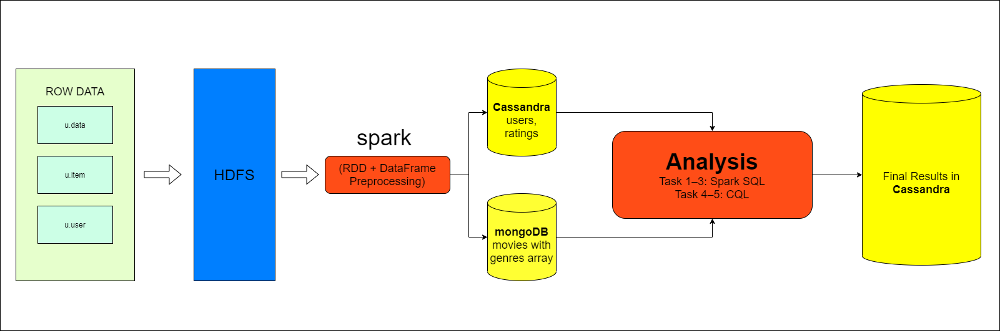

# MovieLens 100k Data Management Pipeline


## Project Architecture

The overall workflow of this project is shown below:




## Environment and Package Versions

The main pipeline was executed in the Hadoop/Spark virtual machine environment.

| Component | Version / Description                                   |
|---|---------------------------------------------------------|
| Python | Python 2.7.5                                            |
| Apache Spark | Spark 2.3.0 in the Hadoop virtual machine               |
| HDFS | Hadoop environment provided by HDP Sandbox              |
| Cassandra | 6.1.0                                                   |
| MongoDB | 3.2.22                                                  |
| PySpark | Provided by Spark runtime through spark-submit; not installed as standalone Python package |
| cassandra-driver | 3.25.0                    |
| pymongo | 3.4.0                     |

## Project Overview

This project is developed for **STQD6324 Data Management - Assignment 02**.

The project builds a data management and analytical pipeline using the **MovieLens 100k dataset**. The pipeline uses **Apache Spark**, **HDFS**, **Cassandra**, and **MongoDB** to load, process, store, analyze, and validate movie rating data.

The main goal of this project is to demonstrate how raw data can be loaded into HDFS, processed using Spark, stored into NoSQL databases, analyzed using Spark SQL and CQL, and finally stored back into Cassandra as analytical result tables.

## Important Execution Note

The Jupyter Notebook in this repository is mainly used to document the project workflow, code logic, screenshots, outputs, and explanations.

Because the Hadoop ecosystem services are configured inside a virtual machine, the full pipeline should be reproduced inside the Hadoop/Spark virtual machine environment by following the commands and scripts provided in the `scripts/` folder.

In other words:

```text
Notebook = workflow explanation, code reference, screenshots, and discussion
scripts/ = actual executable scripts for reproducing the pipeline in the virtual machine
```

To reproduce the project, please follow the Notebook explanation and run the scripts inside the virtual machine environment.

## Dataset

This project uses the **MovieLens 100k Dataset**, especially the following three files:

| File     | Description                            |
| -------- | -------------------------------------- |
| `u.user` | User demographic information           |
| `u.data` | User movie rating records              |
| `u.item` | Movie information and genre indicators |

The dataset files used in this project are also stored in the `data/` folder for local reference.

## Project Architecture

The overall workflow is:

```text
MovieLens raw files
        ↓
Upload to HDFS
        ↓
Read files using Apache Spark
        ↓
Create RDDs
        ↓
Transform RDDs into Spark DataFrames
        ↓
Data cleaning and preprocessing
        ↓
Store structured data into Cassandra
Store movie document data into MongoDB
        ↓
Read data back from databases
        ↓
Perform analytical tasks using Spark SQL and CQL
        ↓
Store final analytical results back into Cassandra
        ↓
Validate Cassandra result tables
```

## Database Design

Different databases are used based on the structure of the data.

| Dataset / Result | Processed DataFrame        | Target Database | Reason                                                  |
| ---------------- | -------------------------- | --------------- | ------------------------------------------------------- |
| `u.user`         | `users_clean_df`           | Cassandra       | Structured user profile data                            |
| `u.data`         | `ratings_clean_df`         | Cassandra       | Large structured rating records                         |
| `u.item`         | `movies_mongo_df`          | MongoDB         | Movie documents with multiple genres stored as an array |
| Task 1 result    | `average_movie_ratings_df` | Cassandra       | Average movie rating result table                       |
| Task 2 result    | `top_10_movies_df`         | Cassandra       | Top 10 movie result table                               |
| Task 3 result    | `favourite_genre_df`       | Cassandra       | Active user favourite genre result table                |
| Task 4 result    | CQL query result           | Cassandra       | Users younger than 20                                   |
| Task 5 result    | CQL query result           | Cassandra       | Scientist users aged 30 to 40                           |

## Analytical Tasks

The project completes the following five analytical tasks:

1. Calculate the average rating for each movie.
2. Identify the top 10 movies with the highest average ratings.
3. Identify users who have rated at least 50 movies and determine their favourite movie genre based on the genre they rated most frequently.
4. Find all users who are less than 20 years old.
5. Find all users whose occupation is `scientist` and whose age is between 30 and 40 years old.

## Repository Structure

```text
Assignment02/
│
├── Assignment_02_MovieLens_Pipeline.ipynb
│
├── data/
│   ├── u.user
│   ├── u.data
│   └── u.item
│
├── scripts/
│   ├── read_hdfs_files.py
│   ├── store_to_databases.py
│   ├── task_1_2_movie_ratings.py
│   ├── task_3_favourite_genre.py
│   └── task_4_5_cql_user_filters.py
│
├── screenshots/
│   ├── rdd_loading_from_hdfs.png
│   ├── cassandra_status.png
│   ├── mongodb_status.png
│   ├── cassandra_table_validation.png
│   ├── mongodb_collection_validation.png
│   ├── store_to_cassandra_mongodb.png
│   ├── analysis_task_1_2.png
│   ├── analysis_task_3.png
│   ├── analysis_task_4_5.png
│   ├── task1_result.png
│   ├── task2_result.png
│   ├── task3_result.png
│   ├── task4_result.png
│   ├── task5_result.png
│   ├── task_1_2_cassandra_storage.png
│   ├── task_3_cassandra_storage.png
│   └── Cassandra_Result_Table_Validation.png
│
├── flow_picture.png
└── readme.md
```

## Environment

The pipeline is designed to run in a Hadoop/Spark virtual machine environment.

The main tools used are:

| Tool         | Purpose                                               |
| ------------ | ----------------------------------------------------- |
| Apache Spark | Data processing and analytical engine                 |
| HDFS         | Raw data storage                                      |
| Cassandra    | Structured data storage and analytical result storage |
| MongoDB      | Document-oriented movie data storage                  |
| Python       | Pipeline scripting                                    |
| CQL          | Cassandra query and validation                        |
| Spark SQL    | Join, aggregation, ranking, and analytical tasks      |

## How to Reproduce

The full pipeline should be executed inside the Hadoop/Spark virtual machine.

### 1. Upload MovieLens Files to HDFS

Create the HDFS directory:

```bash
hdfs dfs -mkdir -p /user/maria_dev/assignment02/movielens/raw
```

Upload the required MovieLens files:

```bash
hdfs dfs -put -f /home/maria_dev/ml-100k/u.user /user/maria_dev/assignment02/movielens/raw/

hdfs dfs -put -f /home/maria_dev/ml-100k/u.data /user/maria_dev/assignment02/movielens/raw/

hdfs dfs -put -f /home/maria_dev/ml-100k/u.item /user/maria_dev/assignment02/movielens/raw/
```

Check whether the files were uploaded successfully:

```bash
hdfs dfs -ls /user/maria_dev/assignment02/movielens/raw/
```

Expected HDFS directory:

```text
/user/maria_dev/assignment02/movielens/raw/
```

### 2. Validate HDFS Reading with Spark

Run the following script inside the virtual machine:

```bash
spark-submit /home/maria_dev/assignment02/scripts/read_hdfs_files.py
```

This script reads the three raw files from HDFS and creates Spark RDDs.

Expected record counts:

| File     | Expected Count |
| -------- | -------------: |
| `u.user` |            943 |
| `u.data` |         100000 |
| `u.item` |           1682 |

### 3. Create Cassandra Keyspace and Tables

Enter Cassandra shell:

```bash
cqlsh
```

Create and use the keyspace:

```sql
CREATE KEYSPACE IF NOT EXISTS movielens_ks
WITH replication = {
    'class': 'SimpleStrategy',
    'replication_factor': 1
};

USE movielens_ks;
```

Create the base tables:

```sql
DROP TABLE IF EXISTS users;

CREATE TABLE users (
    user_id int PRIMARY KEY,
    age int,
    gender text,
    occupation text,
    zip_code text
);

DROP TABLE IF EXISTS ratings;

CREATE TABLE ratings (
    user_id int,
    movie_id int,
    rating int,
    timestamp int,
    PRIMARY KEY ((user_id), movie_id, timestamp)
);
```

Create the analytical result tables:

```sql
DROP TABLE IF EXISTS task1_average_movie_ratings;

CREATE TABLE task1_average_movie_ratings (
    movie_id int PRIMARY KEY,
    movie_title text,
    average_rating double,
    rating_count int
);

DROP TABLE IF EXISTS task2_top_10_movies;

CREATE TABLE task2_top_10_movies (
    rank int PRIMARY KEY,
    movie_id int,
    movie_title text,
    average_rating double,
    rating_count int
);

DROP TABLE IF EXISTS task3_user_favourite_genres;

CREATE TABLE task3_user_favourite_genres (
    user_id int PRIMARY KEY,
    favourite_genre text,
    genre_rating_count int
);

DROP TABLE IF EXISTS task4_young_users;

CREATE TABLE task4_young_users (
    user_id int PRIMARY KEY,
    age int,
    gender text,
    occupation text,
    zip_code text
);

DROP TABLE IF EXISTS task5_scientist_users;

CREATE TABLE task5_scientist_users (
    user_id int PRIMARY KEY,
    age int,
    gender text,
    occupation text,
    zip_code text
);
```

Check the tables:

```sql
DESCRIBE TABLES;
```

The main Cassandra tables are:

```text
users
ratings
task1_average_movie_ratings
task2_top_10_movies
task3_user_favourite_genres
task4_young_users
task5_scientist_users
```

### 4. Store Processed Data into Cassandra and MongoDB

Run the following script:

```bash
spark-submit /home/maria_dev/assignment02/scripts/store_to_databases.py
```

This script performs the following steps:

1. Reads raw files from HDFS.
2. Converts raw files into Spark RDDs.
3. Transforms RDDs into Spark DataFrames.
4. Performs data cleaning and preprocessing.
5. Stores `users_clean_df` and `ratings_clean_df` into Cassandra.
6. Stores `movies_mongo_df` into MongoDB.
7. Reads the stored records back for validation.

Expected validation results:

| Database  | Table / Collection | Expected Count |
| --------- | ------------------ | -------------: |
| Cassandra | `users`            |            943 |
| Cassandra | `ratings`          |         100000 |
| MongoDB   | `movies`           |           1682 |

### 5. Run Task 1 and Task 2

Run the following script:

```bash
spark-submit /home/maria_dev/assignment02/scripts/task_1_2_movie_ratings.py
```

This script:

1. Reads rating data from Cassandra.
2. Reads movie data from MongoDB.
3. Uses Spark SQL to calculate average rating for each movie.
4. Identifies the top 10 movies by average rating.
5. Stores the results back into Cassandra.
6. Reads the result tables back from Cassandra for validation.

Output Cassandra tables:

```text
task1_average_movie_ratings
task2_top_10_movies
```

Expected result counts:

| Table                         | Expected Count |
| ----------------------------- | -------------: |
| `task1_average_movie_ratings` |           1682 |
| `task2_top_10_movies`         |             10 |

### 6. Run Task 3

Run the following script:

```bash
spark-submit /home/maria_dev/assignment02/scripts/task_3_favourite_genre.py
```

This script:

1. Reads rating data from Cassandra.
2. Reads movie data from MongoDB.
3. Explodes the MongoDB `genres` array temporarily in Spark.
4. Finds users who rated at least 50 movies.
5. Calculates each active user's most frequently rated genre.
6. Stores the result back into Cassandra.
7. Reads the result table back from Cassandra for validation.

Output Cassandra table:

```text
task3_user_favourite_genres
```

Expected result count:

| Table                         | Expected Count |
| ----------------------------- | -------------: |
| `task3_user_favourite_genres` |            568 |

### 7. Run Task 4 and Task 5

Run the following script:

```bash
python /home/maria_dev/assignment02/scripts/task_4_5_cql_user_filters.py
```

This script uses CQL to query the Cassandra `users` table.

Task 4 finds users younger than 20.

Task 5 finds users whose occupation is `scientist` and whose age is between 30 and 40.

The results are stored back into Cassandra.

Output Cassandra tables:

```text
task4_young_users
task5_scientist_users
```

Expected result counts:

| Table                   | Expected Count |
| ----------------------- | -------------: |
| `task4_young_users`     |             77 |
| `task5_scientist_users` |             16 |

## Final Cassandra Result Validation

After running all scripts, the result tables can be validated in `cqlsh`:

```sql
USE movielens_ks;

SELECT COUNT(*) FROM task1_average_movie_ratings;
SELECT COUNT(*) FROM task2_top_10_movies;
SELECT COUNT(*) FROM task3_user_favourite_genres;
SELECT COUNT(*) FROM task4_young_users;
SELECT COUNT(*) FROM task5_scientist_users;
```

Expected final result:

| Task   | Cassandra Result Table        | Expected Count |
| ------ | ----------------------------- | -------------: |
| Task 1 | `task1_average_movie_ratings` |           1682 |
| Task 2 | `task2_top_10_movies`         |             10 |
| Task 3 | `task3_user_favourite_genres` |            568 |
| Task 4 | `task4_young_users`           |             77 |
| Task 5 | `task5_scientist_users`       |             16 |

## Notes on Notebook Usage

The Notebook is not intended to be the only executable environment for the full distributed pipeline.

The Notebook is used to:

* Explain the project workflow.
* Show important code blocks.
* Document database design decisions.
* Present screenshots from the virtual machine execution.
* Interpret analytical results.
* Provide conclusions and discussion.

To fully reproduce the project, please run the provided scripts inside the Hadoop/Spark virtual machine environment.

## Screenshots

The `screenshots/` folder contains the main execution and validation screenshots, including:

| Screenshot                              | Description                                     |
| --------------------------------------- | ----------------------------------------------- |
| `rdd_loading_from_hdfs.png`             | Spark successfully reads raw files from HDFS    |
| `cassandra_status.png`                  | Cassandra service validation                    |
| `mongodb_status.png`                    | MongoDB service validation                      |
| `cassandra_table_validation.png`        | Cassandra base table validation                 |
| `mongodb_collection_validation.png`     | MongoDB collection validation                   |
| `store_to_cassandra_mongodb.png`        | Data stored into Cassandra and MongoDB          |
| `task1_result.png`                      | Task 1 analytical output                        |
| `task2_result.png`                      | Task 2 analytical output                        |
| `task3_result.png`                      | Task 3 analytical output                        |
| `task4_result.png`                      | Task 4 CQL output                               |
| `task5_result.png`                      | Task 5 CQL output                               |
| `task_1_2_cassandra_storage.png`        | Task 1 and Task 2 results stored into Cassandra |
| `task_3_cassandra_storage.png`          | Task 3 result stored into Cassandra             |
| `Cassandra_Result_Table_Validation.png` | Final Cassandra result table validation         |

## Limitations

There are several limitations in this project:

1. The MovieLens 100k dataset is relatively small, so the performance advantage of distributed systems may not be fully visible.
2. Some CQL queries use `ALLOW FILTERING` because `age` and `occupation` are not part of the Cassandra primary key.
3. The Top 10 movie ranking is based on average rating, so movies with very few ratings may appear at the top.
4. The pipeline is designed for an educational virtual machine environment, so some configurations may need adjustment in another environment.

## Future Improvements

Possible future improvements include:

* Using a larger MovieLens dataset.
* Designing query-oriented Cassandra tables for user filtering tasks.
* Adding a minimum rating count threshold for Top 10 movie ranking.
* Creating visual dashboards from Cassandra result tables.
* Refactoring repeated database-reading logic into reusable utility modules.
* Adding a separate `.cql` file for Cassandra table creation.

## Conclusion

This project demonstrates a complete data management pipeline using Spark, Cassandra, and MongoDB. It shows how raw data can be loaded into HDFS, processed with Spark, stored in NoSQL databases, analyzed using Spark SQL and CQL, and finally stored back into Cassandra as validated analytical result tables.
